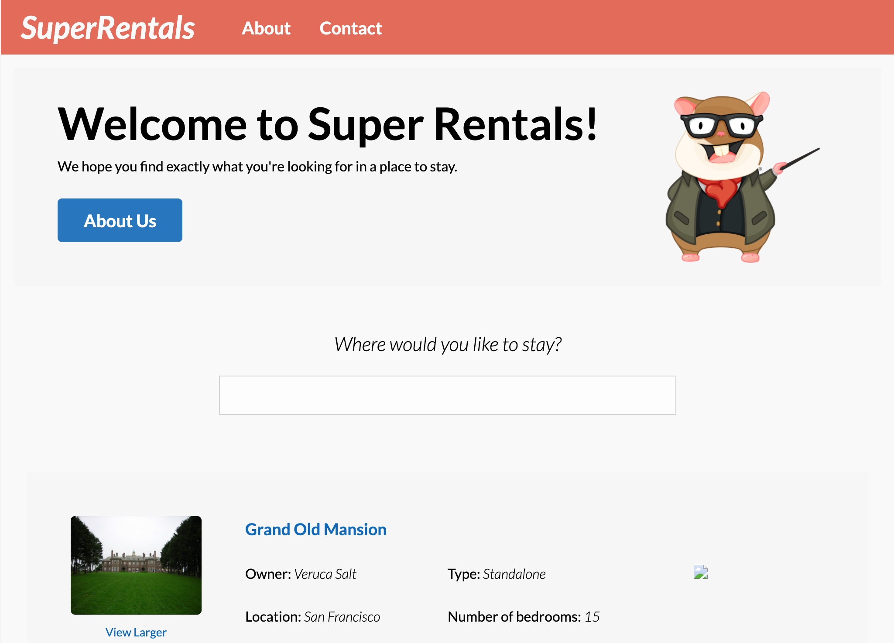

# Learn Ember in 100 Days

### 🤔 What is this

This document was created to help anyone learn Ember in a structured weekly manner.

### 📋 What’s the plan?

Code for a **minimum** of an hour a day
Mon - Fri: Tutorials & Learning
Weekends: Build a small Ember project

### 🎯Goal:

Understand Ember core concepts:

### Architectural Understanding:

*  Model
*  View
*  Controller

### Broad topics:

*  Models
*  Routing
*  The object model
*  Services
*  Components
*  Templating
*  Controllers
*  Ember Data
*  Addons and Dependencies
*  Testing
*  Configuration
*  Binding
*  Handlebars
    *  Functional Helpers
    *  Block helpers
*  Nesting

### Focused Topics:

*  Installing Ember Inspector
*  Reviewing routes with Ember Inspector
*  Loading templates with routes
*  Creating links with the link-to helper
*  Adding component templates
*  Loading model data
*  Customizing components
*  Building nested routes and route objects
*  Loading data with object and array controllers
*  Creating interfaces

### Reading Resources:

1. https://emberjs.com/
2. https://embermap.com/podcast
3. http://www.balinterdi.com/rock-and-roll-with-emberjs
4. https://embermap.com (https://embermap.com/)
5. https://www.emberscreencasts.com (https://www.emberscreencasts.com/)

### Tutorial Resources:

1. https://github.com/ember-learn
2. https://whatpixel.com/emberjs-best-learning-resources/
3. https://hackr.io/tutorials/learn-ember-js
4. https://medium.com/ember-ish/how-to-learn-emberjs-in-a-hurry-c6fdeae256a0
5. https://www.emberscreencasts.com/
6. https://frontendmasters.com/courses/ember-2/
7. http://www.balinterdi.com/rock-and-roll-with-emberjs/
8. https://spin.atomicobject.com/2015/08/24/learn-ember-js-quickly/
9. https://www.icicletech.com/blog/learning-emberjs-front-end-framework
10. https://www.pluralsight.com/courses/ember-2-getting-started
11. http://ember.vicramon.com/?ref=hackr.io
12. https://github.com/ember-learn/super-rentals-tutorial

## Open Source Ember Projects:

1. https://github.com/ember-learn/ember-api-docs
2. https://github.com/ember-weekend/ember-weekend
3. https://github.com/discourse/discourse
4. https://github.com/TryGhost/Ghost-Admin
5. https://github.com/TryGhost/Ghost
6. https://github.com/rust-lang/crates.io
7. https://github.com/storybookjs/storybook
8. https://github.com/cowbell/sharedrop

### 30 Project Ideas:

1. https://auth0.com/blog/build-and-authenticate-an-emberjs-3-application/
2. https://www.youtube.com/playlist?list=PLgTb0cfBmbMDT2IobnuPCRKsvADEjqu4m
3. https://www.twilio.com/blog/2015/08/getting-started-with-ember-js-2-0-using-ember-cli.html
4. Lesson 1: https://yoember.com/
5. Lesson 2: https://yoember.com/
6. Lesson 3: https://yoember.com/
7. Lesson 4: https://yoember.com/
8. Lesson 5: https://yoember.com/
9. Lesson 6: https://yoember.com/
10. Lesson 7: https://yoember.com/
11. https://github.com/ember-learn/super-rentals
12. https://github.com/ember-learn/cli-guides
13. https://www.emberscreencasts.com/tags/building-a-shopping-cart
14. http://ember.vicramon.com/
15. https://www.youtube.com/watch?v=tonV3G2cPrA
16. https://pusher.com/tutorials/chat-emberjs

---

Week 1

Rock & Roll with Ember. JS

- [ ] Introduction to Ember.js
- [ ] Ember CLI
- [ ] Templates and data bindings
- [ ] Routing
- [ ] Nested routes 

- [ ] Controllers
- [ ] Components
- [ ] Advanced routing
- [ ] Talking to a back-end
- [ ] Testing 

---

Week 2

Rock & Roll with Ember. JS

- [ ] Query params
- [ ] Loading and error substates
- [ ] Helpers
- [ ] Authentication
- [ ] Validations
- [ ] Visual testing
- [ ] Deployment 

---

Week 3

Super Rentals

- [ ] Introduction (https://guides.emberjs.com/release/tutorial/part-1/index/)
- [ ] Orientation (https://guides.emberjs.com/release/tutorial/part-1/orientation/)
- [ ] Building Pages (https://guides.emberjs.com/release/tutorial/part-1/building-pages/)
- [ ] Automated Testing (https://guides.emberjs.com/release/tutorial/part-1/automated-testing/)
- [ ] Component Basics (https://guides.emberjs.com/release/tutorial/part-1/component-basics/)
- [ ] More About Components (https://guides.emberjs.com/release/tutorial/part-1/more-about-components/)
- [ ] Interactive Components (https://guides.emberjs.com/release/tutorial/part-1/interactive-components/)
- [ ] Reusable Components (https://guides.emberjs.com/release/tutorial/part-1/reusable-components/)
- [ ] Working With Data (https://guides.emberjs.com/release/tutorial/part-1/working-with-data/)
- [ ] Recap (https://guides.emberjs.com/release/tutorial/part-1/recap/)

---

Week 4

Super Rentals

- [ ] Introduction (https://guides.emberjs.com/release/tutorial/part-2/index/)
- [ ] Route Params (https://guides.emberjs.com/release/tutorial/part-2/route-params/)
- [ ] Service Injection (https://guides.emberjs.com/release/tutorial/part-2/service-injection/)
- [ ] Ember Data (https://guides.emberjs.com/release/tutorial/part-2/ember-data/)
- [ ] Provider Components (https://guides.emberjs.com/release/tutorial/part-2/provider-components/)
- [ ] Recap (https://guides.emberjs.com/release/tutorial/part-2/recap/)

